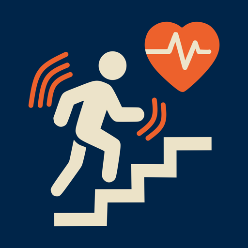

# ClimbPulse ❤️

<p align="center">
  
</p>

<p align="center">
  <strong>Camera-based heart rate monitoring app for iOS</strong>
</p>

<p align="center">
  
  
  
  
</p>

---

## 📱 About

**ClimbPulse** is an iOS application that measures heart rate using photoplethysmography (PPG) through the iPhone's rear camera and flashlight. Simply place your finger over the camera lens, and the app detects blood volume changes to calculate your real-time BPM.

Built with SwiftUI and native iOS frameworks — no external dependencies required.

---

## ✨ Features

- **📷 Camera-based PPG**: Uses the rear camera with flashlight to detect pulse through fingertip
- **📊 Real-time Visualization**: Live PPG waveform display during measurement
- **🎯 Signal Quality Assessment**: Automatic detection of good vs noisy signal
- **💾 Local Storage**: Save and review your measurement history
- **🌙 Dark Mode Support**: Beautiful UI with JYU-inspired color palette
- **📤 Share Results**: Export measurements via iOS share sheet
- **🔬 Advanced Signal Processing**: Band-pass filtering and peak detection for accurate BPM estimation

---

## 🖼️ Screenshots

| Home Screen | Recording | Results |
|:-----------:|:---------:|:-------:|
| Start measurement | Live PPG waveform | BPM result with quality |

---

## 🛠️ Technical Details

### Signal Processing Pipeline

1. **PPG Capture**: Camera frames analyzed for red channel intensity changes
2. **Preprocessing**: Linear detrending, median filtering, soft clipping
3. **Band-pass Filter**: IIR filter isolating 0.6–4.0 Hz (heart rate band)
4. **Peak Detection**: Adaptive threshold-based local maxima detection
5. **BPM Calculation**: Median inter-peak interval for robustness

### Architecture

```
ClimbPulse/
├── API/                  # Backend integration (stub)
│   └── APIClient.swift
├── Capture/              # Camera & signal processing
│   ├── CameraManager.swift
│   └── PPGProcessor.swift
├── Models/               # Data models
│   ├── Measurement.swift
│   └── PPGSample.swift
├── Storage/              # Local persistence
│   └── MeasurementStore.swift
├── Views/                # SwiftUI views
│   ├── HomeView.swift
│   ├── RecordingView.swift
│   ├── ResultsView.swift
│   ├── HistoryView.swift
│   ├── ProfileView.swift
│   └── Components/
│       ├── CameraPreviewView.swift
│       ├── PPGWaveformView.swift
│       └── StaticPPGPlotView.swift
└── ClimbPulseApp.swift   # App entry point
```

---

## 📋 Requirements

- **iOS 18.5** or later
- **iPhone** with rear camera and flashlight
- **Xcode 26.1** or later (for development)

---

## 🚀 Getting Started

### Installation

1. **Clone the repository**
   ```bash
   git clone https://github.com/yourusername/ClimbPulse.git
   cd ClimbPulse
   ```

2. **Open in Xcode**
   ```bash
   open ClimbPulse.xcodeproj
   ```

3. **Configure signing**
   - Select the project in the navigator
   - Go to "Signing & Capabilities"
   - Set your development team

4. **Build and run**
   - Select your target device
   - Press `Cmd + R` to build and run

### Usage

1. Launch the app and grant camera permission
2. Tap **Start Measurement**
3. Place your fingertip over the rear camera and flashlight
4. Hold still for 30 seconds
5. View your BPM result and signal quality

---

## 🔒 Privacy

ClimbPulse uses the camera **only** for heart rate measurement. All processing happens locally on-device. Measurement data is stored locally and never transmitted unless you explicitly choose to share.

### Permissions Required
- **Camera**: Required for PPG measurement

---

## 🤝 Contributing

Contributions are welcome! Please feel free to submit a Pull Request.

1. Fork the project
2. Create your feature branch (`git checkout -b feature/AmazingFeature`)
3. Commit your changes (`git commit -m 'Add some AmazingFeature'`)
4. Push to the branch (`git push origin feature/AmazingFeature`)
5. Open a Pull Request

---

## 📄 License

This project is licensed under the MIT License — see the [LICENSE](LICENSE) file for details.

---

## 👤 Author

**University of Jyväskylä (JYU)**

---

## 🙏 Acknowledgments

- Built with SwiftUI and AVFoundation
- Signal processing algorithms based on established PPG research
- UI design inspired by modern health & fitness apps

---

